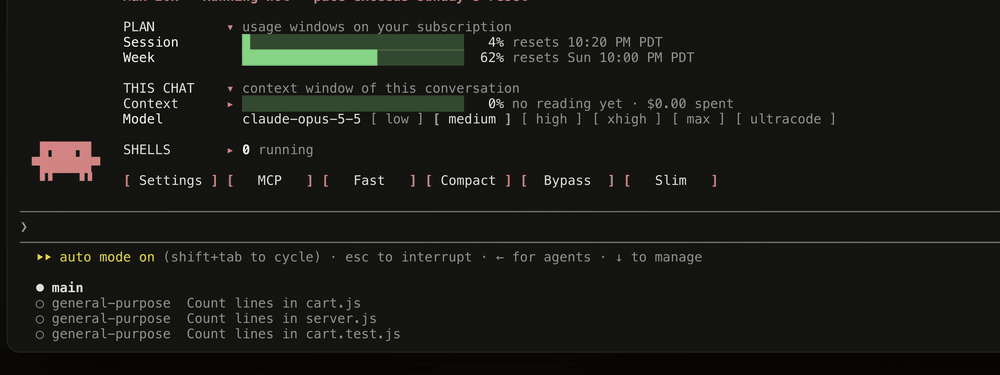

# Claude Dock

**Two plugins that make Claude Code feel like your own.**

## Claude Dock

A live dashboard right above your prompt. It shows your plan's session and weekly limits with their resets, this chat's context and spend, and the shells you have running. You can set the model's effort in one click and switch ultracode on. Make it yours with colours, line styles and a wave shimmer. Pick a chime for when Claude finishes or needs you. And meet the small companion who climbs ladders and carries an umbrella.

**[Read more about Claude Dock →](cc-dock/README.md)**

## Agent Model Badge

Every subagent, labelled with the model it really runs on. It appears in the task list, on the agent's row and in its "finished" line. A toast warns you when a spawn lands on a different model family than it asked for.

**[Read more about Agent Model Badge →](agent-model-badge/README.md)**

## Contributing

Ideas and fixes are welcome. Read [AGENTS.md](AGENTS.md) first: it covers how the plugins are built, the design rules, and how to test a change. The main rule is to read state from what Claude Code itself reports, never from a guess.

## Requirements

Both plugins are for Claude Code in the terminal, version 2.1.292 or later. The desktop app, VS Code, claude.ai chat and Cowork aren't supported.
