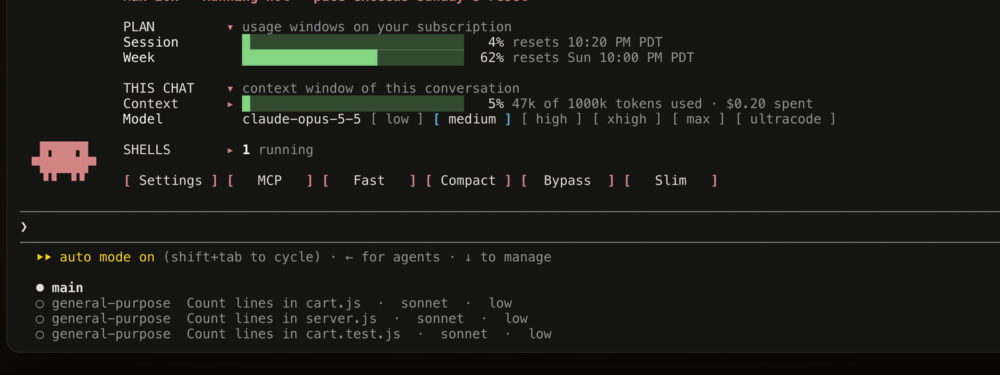

<div align="center">

# Agent Model Badge

**See the model and effort every subagent really runs on.**


</div>

When Claude spawns subagents, Claude Code shows what each one is doing, but not which model it runs on. Agent Model Badge adds that. Each subagent's row, its entry in the task list, and its "finished" line carry its model and thinking effort. The task list shows the model the call asked for, or your session's own model when the call names none, with the effort the call asked for or the one that model last ran at in this session. The transcript row then shows the model and effort the agent really runs on, from its first request.

```text
◯ general-purpose  Count lines in cart.js  ·  sonnet  ·  low
◯ general-purpose  Count lines in server.js  ·  sonnet  ·  low
◯ general-purpose  Count lines in cart.test.js  ·  sonnet  ·  low

⏺ Agent "Count lines in cart.js  ·  sonnet  ·  low" finished · 5s
```



## Surprise models, caught early

If a subagent asks for one model and its first request runs on another family, the badge raises a toast that names both. You can stop the run before it spends the wrong model's budget. A newer version of the same family, like `claude-haiku-5-5` for an agent that asked for haiku, counts as a match and stays quiet.

## Background agents and workflows

Agents sent to the background get their label in the task list too. The badge never posts under a call that has already closed, so it adds no error lines to your transcript. Agents a workflow starts aren't labelled, because they don't come from an Agent call the badge can see.

## What it reads, writes and sends

Nothing leaves your machine. The badge keeps its labels in memory for the session only, writes no files, changes no settings, runs no programs or commands, and makes no network requests. The full [privacy policy](PRIVACY.md) says the same in one place.

**What each hook does:**
- **`tool.call` on `Agent`**: changes one input. It appends ` · <model> · <effort>` to the call's `description`, the short task name shown in the task list, and changes nothing else. It returns the tool's own result unchanged.
- **`turn.step`**: reads the model and effort of each request. On a subagent's first request it looks the agent up in Claude Code's own agent list to find the Agent call that started it, then raises the mismatch toast if the model family differs. It passes every request on unchanged.
- **`ui.render` on `ToolUse`**: draws the Agent row exactly as Claude Code does, with the model and effort beside it. Rows of other tools are left alone.

It never changes how an agent is started: the model, prompt, tools and permissions are always the ones Claude asked for.

## Where it runs

Claude Code in the terminal only, version 2.1.292 or later. The desktop app, VS Code, claude.ai chat and Cowork aren't supported.
