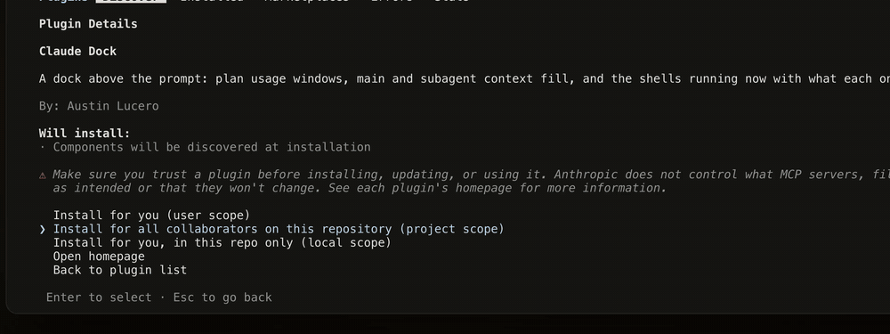
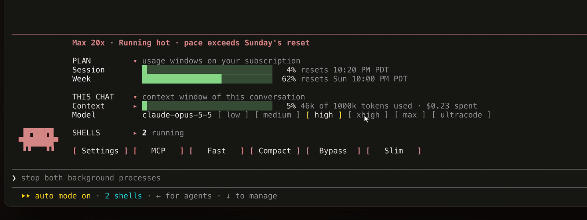
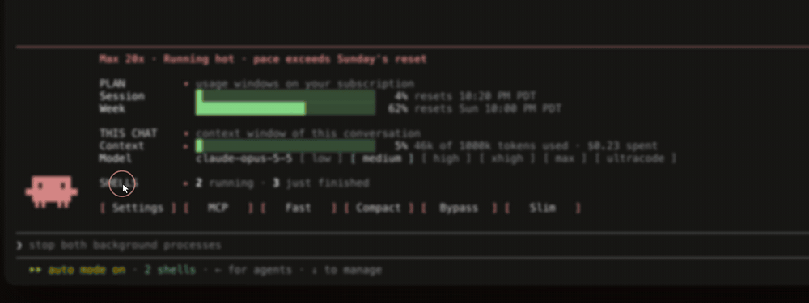
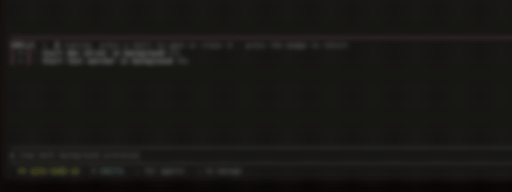
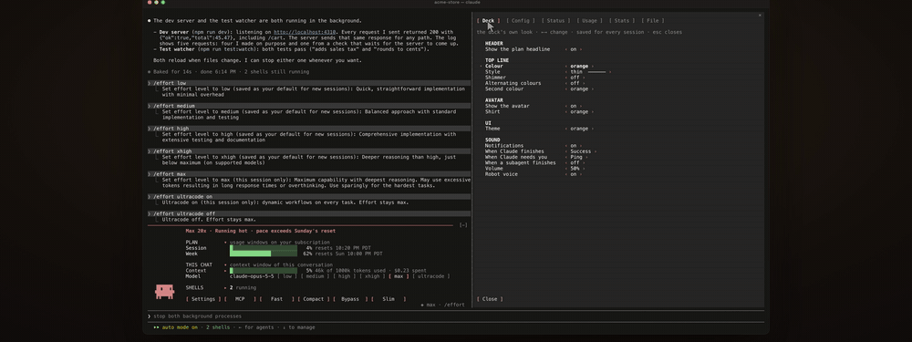
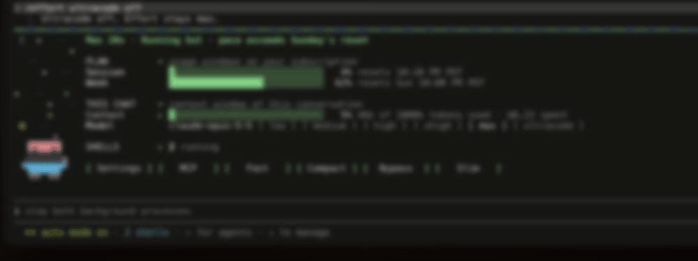
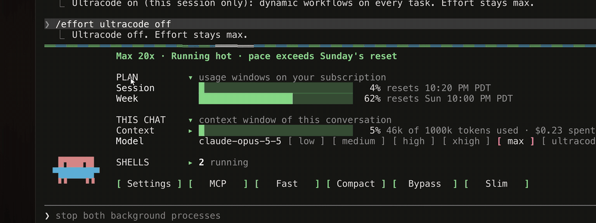
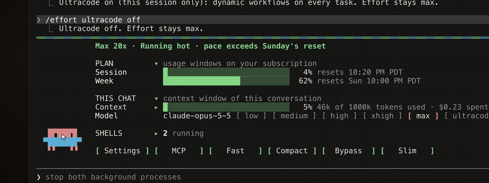

<div align="center">

# Claude Dock

**A live dashboard that lives right above your Claude Code prompt.**

Your plan's limits, this chat's context, the shells you have running, the model and its effort, all in one band that updates as you work. Plus a small companion who has opinions.



</div>

## At a glance

This is the dock exactly as it draws in a 210-column terminal, mid-session:

```text
────────────────────────────────────────────────────────────────────────────────────────────────────────
             Max 20x · Running hot · pace exceeds Sunday's reset

             PLAN         ▾ usage windows on your subscription
             Session        █████████░░░░░░░░░░░░░░░░░░░  32% resets 5:20 PM PDT
             Week           █████████████████░░░░░░░░░░░  60% resets Sun 10:00 PM PDT

             THIS CHAT    ▾ context window of this conversation
             Context      ▸ █░░░░░░░░░░░░░░░░░░░░░░░░░░░   5% 54k of 1000k tokens used · $0.30 spent
             Model          claude-opus-5-5 [ low ] [ medium ] [ high ] [ xhigh ] [ max ] [ ultracode ]

  ▐█▜██▛█    SHELLS       ▸ 1 running · 4 just finished
 ▝▜██████▀
  ▝▝   ▝▝    [ Settings ] [   Fast   ] [ Compact ] [   Slim   ]
```

## What it shows



- **PLAN** shows your subscription's five-hour and weekly windows, each with its reset time. If your plan also has a weekly limit for one model, that model gets its own row under the week. A headline sums up your pace against the next reset.
- **THIS CHAT** shows how full this conversation's context is, how many tokens that is, and what the chat has cost so far. Subagents get their own rows while they run.
- **Model** names the model actually answering, read live from the session, so a `/model` switch shows within a second.
- **SHELLS** lists the background shells and tasks running now, each with its latest line of output. Shells started before the dock loaded count too.
- **The button row** opens Settings, switches Fast mode, runs Compact after a confirm, and folds the dock to Slim.

## Every shell, live



Press **SHELLS** to see every background shell and task this session is running, with how long each has been going. Open one to read its latest output, like a dev server's request log or a test watcher's results, without leaving your prompt.

Turn on **Settings → Dock → SHELLS → Background servers and watchers**, and commands that never finish on their own run in the background automatically, so Claude keeps answering while they run. That covers dev servers, watch modes, `tail -f` and local web servers. Everything else runs exactly as Claude asked. It's off by default.

## Effort in one click



The chips run from low to max, each in its own colour, and the lit one is the level the engine is really using. Pressing one runs `/effort` for you, waiting for the current turn to finish if one is running. **Ultracode** is a chip too, and when it's on your companion holds the sparkler.

## Make it yours



**Settings → Dock** holds the dock's own look, every row stepped with the arrow keys and saved for every session:

- **Header**: show or hide the plan headline.
- **Top line**: colour, style (thin, double, heavy and more), a wave shimmer, and alternating colours.
- **Avatar**: show or hide him, and pick his shirt.
- **UI**: the theme colour for every bracket, button and menu accent.
- **Shells**: run servers and watchers in the background, covered above.
- **Permissions**: show the Bypass button, off by default. Covered under *What it reads, writes and sends*.
- **Sound**: covered below.

The other tabs mirror Claude Code itself, to read. **Config** lists every `/config` setting and its value; change them with `/config`. **Status**, **Usage** and **Stats** show what their commands show. **File** shows your `settings.json` as a tree.

## Sounds

The dock can chime when Claude finishes, when Claude needs you, and when a subagent finishes. "Needs you" covers a permission prompt or a question. Each moment has its own sound, picked from ten, or off. Success, Ping and Bubble were made for the dock, and the other seven are from Kenney's public-domain Interface Sounds:

| Sound | Character |
| --- | --- |
| Success | a rising three-note jingle |
| Ping | a crisp UI ping |
| Bubble | a round bloop |
| Chime | a bright two-tone confirmation |
| Glass | a clean glass tap |
| Confirm | a soft confirming blip |
| Question | a curious rising query |
| Rise | an upward sweep |
| Drop | a low drop |
| Pluck | a short pluck |

Everything lives under **Settings → Dock → SOUND**:

- **Notifications** switches every chime on or off at once.
- **The three moments** each pick their own sound, and every choice plays as you cycle to it.
- **Volume** sets how loud the chimes are.
- **Robot voice** switches one of the dock's surprises on or off. We'll let you find out which.

The finished sound waits until no background work is still running, so you hear it once, when it's really done.

## Slim when you need the room



One click folds the dock to a single strip, with the companion and the buttons. **Bulk** brings the whole dock back, every section open.

## A few surprises

He climbs. He gets rained on. He has other moods too, which we'll leave for you to find.





## What it reads, writes and sends

Everything stays on your machine except one request to Anthropic, described below. The full [privacy policy](PRIVACY.md) says the same in one place.

**Network.** The dock contacts one host, `api.anthropic.com`. About once a minute while the session is open, and at most once a minute after each model response (longer after a rate-limit response), it sends a GET request to `https://api.anthropic.com/api/oauth/usage`, the endpoint Claude Code's `/usage` command uses, to read your plan's usage windows and plan tier. The request carries your Claude Code login as a bearer token and sends nothing else. There is no other network destination.

**Your login.** That request needs the Claude Code login already on this machine, so the dock reads it from the macOS keychain entry `Claude Code-credentials`, or from `~/.claude/.credentials.json` where there is no keychain. Asking you to paste the token into a setting instead would mean copying a secret by hand. The token is held in memory for that one request and is never logged, drawn or stored. Without a login, the dock draws the limits Claude Code itself reports.

**Programs it runs.** Two fixed commands, nothing else:
- `security find-generic-password -s "Claude Code-credentials" -w`, on macOS, to read the login above.
- `id -u`, once per session, to find the folder where Claude Code keeps background shell output (`/private/tmp/claude-<uid>/…/tasks`), so the shells view can show each shell's latest line.

**Claude Code commands it runs.** Only when you press the matching control:
- `/effort <level>`, including `/effort ultracode on|off`, when you press an effort chip. Claude Code saves the level as it normally does.
- `/fast` when you press Fast.
- Compact, once you confirm it, compacts the conversation through Claude Code's own compaction, as `/compact` does.

Apart from the optional Bypass probe described below, it runs no tools and starts no agents.

**Files it reads.** `~/.claude/settings.json`, `~/.claude/stats-cache.json`, `~/.claude/sessions/*.json`, the account block of `~/.claude.json`, and background shell output files, to draw settings, stats, session names, your account's display name, and shell output. It never draws or stores tokens.

**Files it writes.** None of its own, apart from the optional Bypass probe described below, which creates an empty `/tmp/cc-dock-bypass-probe` and never removes it. Its settings (look, sounds, folded sections, the last plan reading) are kept in Claude Code's plugin store on your machine. It changes no configuration and sets no environment variables.

**What each hook does:**
- **`tool.call` on `Bash`**: lists each shell command in the dock, except the Bypass probe below, and returns the tool's own result unchanged. With **Background servers and watchers** switched on (off by default), it changes one input: it sets `run_in_background` to true for a command that never ends on its own, such as a dev server or a watch mode. It changes nothing else.
- **`turn.step`**: reads the model and effort of each request. After you press an effort chip, and only until `/effort` has run, it sets that effort on the main conversation's requests so the chip takes effect at once.
- **`command.run` on `/model`, `/effort` and `/fast`**: passes each command on unchanged and reads its reply to keep the dock current. On `/ladder`, `/snake` and `/chatter`, the dock's own commands, it plays that animation.
- **`classic.Stop`, `classic.SubagentStop` and `classic.Notification`**: play the chime you picked and update the shells list. They decide nothing and pass every event on unchanged.
- **`ui.render`**: draws the dock above the prompt (`AbovePrompt`) and its Settings pane (`Pane`). On the footer (`PromptHint`) it only reads the permission mode, the shell count and whether a turn is running, and draws it unchanged.
- **`classic.PermissionRequest`**: answers only the Bypass probe's own prompt, and only right after you confirmed Bypass. It passes every other permission prompt on unchanged.
- **`session.start`, `session.measure`, `turn.complete` and `ui.message`**: read session figures and your clicks in the dock. They change nothing.

**Bypass**, only once you show the button: when you confirm it, the dock asks the permission check whether a harmless `touch /tmp/cc-dock-bypass-probe` would prompt. If the footer already shows bypass, or the check would allow the command, nothing runs and the button says so. If the check refuses it, nothing runs and the button says it is blocked. Otherwise the dock runs that one Bash command, which creates an empty `/tmp/cc-dock-bypass-probe` and leaves it there, and answers the prompt it raises with a session mode change to bypass; the footer confirms it. That probe is the only command it ever runs for this, and the shells list does not show it.

**Sound.** It plays its bundled sounds through Claude Code's audio player, which is `afplay` on macOS. Other platforms stay silent.

## Where it runs

Claude Code in the terminal only, version 2.1.292 or later. It draws nothing in the desktop app, VS Code, claude.ai chat or Cowork.
